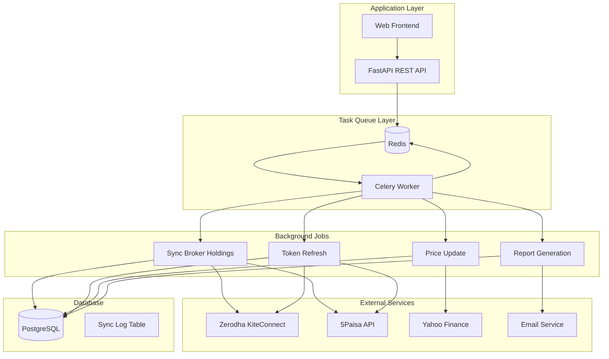

# Background Sync Architecture with Celery/Redis

## Overview

This document describes the architecture for implementing background synchronization of broker holdings and transactions using Celery with Redis as the message broker and result backend.

## Architecture Diagram



## Component Details

### 1. Redis Configuration

```python
# config.py additions
class Settings:
    @property
    def REDIS_URL(self) -> str:
        return os.getenv("REDIS_URL", "redis://localhost:6379/0")
    
    @property
    def CELERY_RESULT_URL(self) -> str:
        return os.getenv("CELERY_RESULT_URL", "redis://localhost:6379/1")
```

### 2. Celery Configuration

```python
# portfolio_tracker/celery.py
from celery import Celery
from portfolio_tracker.config import settings

celery_app = Celery(
    "portfolio_tracker",
    broker=settings.REDIS_URL,
    backend=settings.CELERY_RESULT_URL,
    include=["portfolio_tracker.jobs.holdings_sync", "portfolio_tracker.jobs.token_refresh"]
)

celery_app.conf.update(
    task_serializer="json",
    accept_content=["json"],
    result_serializer="json",
    timezone="Asia/Kolkata",
    enable_utc=True,
    task_track_started=True,
    task_time_limit=3600,  # 1 hour max
    worker_prefetch_multiplier=4,
    task_acks_late=True,
    task_reject_on_worker_lost=True,
    result_expires=86400,  # 24 hours
)

# Beat schedule for periodic tasks
celery_app.conf.beat_schedule = {
    "sync-holdings-hourly": {
        "task": "portfolio_tracker.jobs.holdings_sync.sync_all_broker_holdings",
        "schedule": 3600.0,  # Every hour
        "options": {"queue": "periodic"}
    },
    "refresh-tokens-daily": {
        "task": "portfolio_tracker.jobs.token_refresh.refresh_expiring_tokens",
        "schedule": 86400.0,  # Daily
        "options": {"queue": "periodic"}
    },
    "update-prices-daily": {
        "task": "portfolio_tracker.jobs.price_update.update_all_prices",
        "schedule": 300.0,  # Every 5 minutes during market hours
        "options": {"queue": "price_updates"}
    },
}
```

### 3. Database Schema for Sync Tracking

```sql
-- migrations/006_add_sync_tracking.sql

-- Sync job log table
CREATE TABLE sync_jobs (
    id SERIAL PRIMARY KEY,
    job_type VARCHAR(50) NOT NULL,  -- 'holdings', 'transactions', 'prices'
    broker_name VARCHAR(50),
    user_id INTEGER REFERENCES users(id),
    portfolio_id INTEGER REFERENCES portfolios(id),
    status VARCHAR(20) NOT NULL,  -- 'pending', 'running', 'success', 'failed'
    started_at TIMESTAMP WITH TIME ZONE,
    completed_at TIMESTAMP WITH TIME ZONE,
    records_processed INTEGER DEFAULT 0,
    records_failed INTEGER DEFAULT 0,
    error_message TEXT,
    created_at TIMESTAMP WITH TIME ZONE DEFAULT NOW()
);

-- Index for efficient querying
CREATE INDEX idx_sync_jobs_status ON sync_jobs(status);
CREATE INDEX idx_sync_jobs_user ON sync_jobs(user_id, job_type);
CREATE INDEX idx_sync_jobs_created ON sync_jobs(created_at DESC);

-- Rate limiting table for API calls
CREATE TABLE api_rate_limits (
    id SERIAL PRIMARY KEY,
    broker_name VARCHAR(50) NOT NULL,
    user_id INTEGER REFERENCES users(id),
    requests_count INTEGER DEFAULT 0,
    window_start TIMESTAMP WITH TIME ZONE,
    created_at TIMESTAMP WITH TIME ZONE DEFAULT NOW()
);

CREATE INDEX idx_api_rate_limits_broker ON api_rate_limits(broker_name, window_start);
```

### 4. Sync Job Models

```python
# portfolio_tracker/models/sync_models.py
from datetime import datetime
from enum import Enum
from typing import Optional

from sqlalchemy import Column, DateTime, Integer, String, Text
from sqlalchemy.orm import relationship

from portfolio_tracker.database import Base


class SyncJobType(str, Enum):
    HOLDINGS = "holdings"
    TRANSACTIONS = "transactions"
    PRICES = "prices"
    TOKEN_REFRESH = "token_refresh"


class SyncJobStatus(str, Enum):
    PENDING = "pending"
    RUNNING = "running"
    SUCCESS = "success"
    FAILED = "failed"
    PARTIAL = "partial"  # Some succeeded, some failed


class SyncJobModel(Base):
    """Model for tracking sync job status."""
    
    __tablename__ = "sync_jobs"
    
    id = Column(Integer, primary_key=True, index=True)
    job_type = Column(String(50), nullable=False)
    broker_name = Column(String(50), nullable=True)
    user_id = Column(Integer, nullable=True, index=True)
    portfolio_id = Column(Integer, nullable=True)
    status = Column(String(20), nullable=False, default=SyncJobStatus.PENDING)
    started_at = Column(DateTime(timezone=True), nullable=True)
    completed_at = Column(DateTime(timezone=True), nullable=True)
    records_processed = Column(Integer, default=0)
    records_failed = Column(Integer, default=0)
    error_message = Column(Text, nullable=True)
    created_at = Column(DateTime(timezone=True), default=lambda: datetime.utcnow())
```

### 5. Holdings Sync Task

```python
# portfolio_tracker/jobs/holdings_sync.py
import logging
from datetime import datetime, timezone
from typing import Optional

from celery import shared_task
from sqlalchemy.orm import Session

from portfolio_tracker import crud
from portfolio_tracker.database import get_db
from portfolio_tracker.encryption import EncryptionManager
from portfolio_tracker.models.sync_models import SyncJobModel, SyncJobStatus, SyncJobType


logger = logging.getLogger(__name__)


@shared_task(
    bind=True,
    name="portfolio_tracker.jobs.holdings_sync.sync_single_broker",
    max_retries=3,
    default_retry_delay=300,  # 5 minutes
    autoretry_for=(Exception,),
    retry_backoff=True,
)
def sync_single_broker(
    self,
    user_id: int,
    broker_name: str,
    portfolio_id: int,
    sync_job_id: int,
) -> dict:
    """
    Sync holdings for a single broker.
    
    Args:
        user_id: User ID
        broker_name: Broker name (zerodha, fivepaisa)
        portfolio_id: Portfolio ID to sync to
        sync_job_id: Sync job ID for tracking
    
    Returns:
        Dict with sync results
    """
    db: Session = next(get_db())
    
    try:
        # Update job status
        sync_job = db.query(SyncJobModel).filter(SyncJobModel.id == sync_job_id).first()
        if sync_job:
            sync_job.status = SyncJobStatus.RUNNING
            sync_job.started_at = datetime.now(timezone.utc)
            db.commit()
        
        # Get broker config
        config = crud.get_broker_config_by_broker_name(db, user_id, broker_name)
        if not config:
            raise ValueError(f"Broker {broker_name} not configured for user")
        
        # Decrypt credentials
        api_key = EncryptionManager.decrypt(config.api_key or "")
        api_secret = EncryptionManager.decrypt(config.api_secret or "")
        access_token = EncryptionManager.decrypt(config.access_token or "")
        
        # Get broker and sync holdings
        if broker_name == "zerodha":
            from portfolio_tracker.brokers.zerodha import ZerodhaBroker
            broker = ZerodhaBroker(api_key=api_key, api_secret=api_secret)
            broker.set_token(access_token)
            holdings = broker.get_holdings()
        elif broker_name == "fivepaisa":
            from portfolio_tracker.brokers.fivepaisa import FivePaisaBroker
            # Load extra config
            extra = {}
            if config.extra_config:
                try:
                    extra = json.loads(EncryptionManager.decrypt(config.extra_config))
                except Exception:
                    pass
            broker = FivePaisaBroker(
                api_key=api_key,
                api_secret=api_secret,
                app_name=extra.get("app_name", ""),
                app_source=extra.get("app_source", ""),
                user_id=extra.get("user_id", ""),
                password=extra.get("password", ""),
            )
            broker.set_token(access_token)
            holdings = broker.get_holdings()
        else:
            raise ValueError(f"Unsupported broker: {broker_name}")
        
        # Process holdings (same logic as current sync endpoint)
        assets_imported = process_holdings(db, portfolio_id, holdings)
        
        # Update job status
        if sync_job:
            sync_job.status = SyncJobStatus.SUCCESS
            sync_job.completed_at = datetime.now(timezone.utc)
            sync_job.records_processed = len(holdings)
            sync_job.records_failed = 0
            db.commit()
        
        # Update broker last_synced
        crud.update_broker_config(db, config.id, last_synced=datetime.now(timezone.utc))
        
        return {
            "success": True,
            "broker": broker_name,
            "holdings_count": len(holdings),
            "assets_imported": assets_imported,
        }
        
    except Exception as e:
        logger.error(f"Sync failed for {broker_name}: {e}")
        
        # Update job status
        sync_job = db.query(SyncJobModel).filter(SyncJobModel.id == sync_job_id).first()
        if sync_job:
            sync_job.status = SyncJobStatus.FAILED
            sync_job.completed_at = datetime.now(timezone.utc)
            sync_job.error_message = str(e)
            db.commit()
        
        # Retry if max retries not reached
        if self.request.retries < self.max_retries:
            raise
        
        return {
            "success": False,
            "broker": broker_name,
            "error": str(e),
        }


@shared_task(
    name="portfolio_tracker.jobs.holdings_sync.sync_all_broker_holdings",
    time_limit=3600,
)
def sync_all_broker_holdings() -> dict:
    """
    Sync holdings for all users with connected brokers.
    Runs hourly via Celery beat.
    """
    db: Session = next(get_db())
    
    try:
        # Get all active broker configs
        configs = crud.get_all_active_broker_configs(db)
        
        results = []
        for config in configs:
            # Get user's portfolios
            portfolios = crud.get_portfolios_by_user(db, config.user_id)
            
            for portfolio in portfolios:
                # Create sync job record
                sync_job = SyncJobModel(
                    job_type=SyncJobType.HOLDINGS,
                    broker_name=config.broker_name,
                    user_id=config.user_id,
                    portfolio_id=portfolio.id,
                    status=SyncJobStatus.PENDING,
                )
                db.add(sync_job)
                db.commit()
                db.refresh(sync_job)
                
                # Queue the sync task
                sync_single_broker.delay(
                    user_id=config.user_id,
                    broker_name=config.broker_name,
                    portfolio_id=portfolio.id,
                    sync_job_id=sync_job.id,
                )
                
                results.append({
                    "user_id": config.user_id,
                    "broker": config.broker_name,
                    "portfolio_id": portfolio.id,
                    "job_id": sync_job.id,
                })
        
        return {
            "success": True,
            "jobs_queued": len(results),
            "jobs": results,
        }
        
    except Exception as e:
        logger.error(f"Failed to queue sync jobs: {e}")
        return {
            "success": False,
            "error": str(e),
        }
```

### 6. Token Refresh Task

```python
# portfolio_tracker/jobs/token_refresh.py
import logging
from datetime import datetime, timedelta, timezone

from celery import shared_task

from portfolio_tracker import crud
from portfolio_tracker.database import get_db
from portfolio_tracker.encryption import EncryptionManager


logger = logging.getLogger(__name__)


@shared_task(
    name="portfolio_tracker.jobs.token_refresh.refresh_expiring_tokens",
    time_limit=1800,
)
def refresh_expiring_tokens() -> dict:
    """
    Refresh broker tokens that are about to expire.
    Runs daily via Celery beat.
    """
    db = next(get_db())
    
    try:
        # Get all broker configs with tokens
        configs = crud.get_all_broker_configs_with_tokens(db)
        
        refreshed = []
        failed = []
        
        for config in configs:
            try:
                # Decrypt tokens
                access_token = EncryptionManager.decrypt(config.access_token or "")
                refresh_token = EncryptionManager.decrypt(config.refresh_token or "") if config.refresh_token else None
                
                # Skip if no refresh token (Zerodha doesn't have refresh)
                if not refresh_token:
                    continue
                
                # Refresh token based on broker
                if config.broker_name == "fivepaisa":
                    from portfolio_tracker.brokers.fivepaisa import FivePaisaBroker
                    
                    # Load extra config
                    extra = {}
                    if config.extra_config:
                        try:
                            extra = json.loads(EncryptionManager.decrypt(config.extra_config))
                        except Exception:
                            pass
                    
                    broker = FivePaisaBroker(
                        api_key=EncryptionManager.decrypt(config.api_key or ""),
                        api_secret=EncryptionManager.decrypt(config.api_secret or ""),
                        app_name=extra.get("app_name", ""),
                        app_source=extra.get("app_source", ""),
                        user_id=extra.get("user_id", ""),
                        password=extra.get("password", ""),
                        access_token=access_token,
                        refresh_token=refresh_token,
                    )
                    
                    new_access, new_refresh = broker.refresh_access_token()
                    
                    # Save new tokens
                    crud.update_broker_config(
                        db,
                        config.id,
                        access_token=EncryptionManager.encrypt(new_access),
                        refresh_token=EncryptionManager.encrypt(new_refresh) if new_refresh else None,
                    )
                    
                    refreshed.append(config.broker_name)
                    
            except Exception as e:
                logger.error(f"Failed to refresh token for {config.broker_name}: {e}")
                failed.append({
                    "broker": config.broker_name,
                    "error": str(e),
                })
        
        return {
            "success": True,
            "refreshed_count": len(refreshed),
            "failed_count": len(failed),
            "failed": failed,
        }
        
    except Exception as e:
        logger.error(f"Token refresh job failed: {e}")
        return {
            "success": False,
            "error": str(e),
        }
```

### 7. Price Update Task

```python
# portfolio_tracker/jobs/price_update.py
import logging
from datetime import datetime, timedelta, timezone

from celery import shared_task
import yfinance as yf

from portfolio_tracker import crud
from portfolio_tracker.database import get_db
from portfolio_tracker.models import AssetModel


logger = logging.getLogger(__name__)


@shared_task(
    name="portfolio_tracker.jobs.price_update.update_all_prices",
    time_limit=600,
)
def update_all_prices() -> dict:
    """
    Update current prices for all held assets.
    Runs every 5 minutes during market hours.
    """
    db = next(get_db())
    
    try:
        # Get all active assets
        assets = db.query(AssetModel).all()
        
        # Group by symbol to minimize API calls
        symbols = list(set([asset.symbol for asset in assets]))
        
        # Fetch prices from Yahoo Finance
        if not symbols:
            return {"success": True, "updated": 0}
        
        # Download data
        tickers = " ".join(symbols)
        data = yf.download(tickers, period="1d", progress=False)
        
        updated = 0
        failed = []
        
        for asset in assets:
            try:
                # Get price from downloaded data
                if asset.symbol in data.columns.get_level_values(0):
                    price = data[asset.symbol]["Close"].iloc[-1]
                    
                    # Update asset
                    asset.current_price = price
                    asset.last_price_update = datetime.now(timezone.utc)
                    updated += 1
                else:
                    failed.append(asset.symbol)
                    
            except Exception as e:
                logger.error(f"Failed to update price for {asset.symbol}: {e}")
                failed.append(asset.symbol)
        
        db.commit()
        
        return {
            "success": True,
            "updated": updated,
            "failed": failed,
        }
        
    except Exception as e:
        logger.error(f"Price update job failed: {e}")
        return {
            "success": False,
            "error": str(e),
        }
```

### 8. API Endpoints for Sync Management

```python
# portfolio_tracker/routers/sync.py
import logging
from datetime import datetime, timezone
from typing import Optional

from fastapi import APIRouter, Depends, HTTPException, Query, status
from sqlalchemy.orm import Session

from portfolio_tracker.database import get_db
from portfolio_tracker.deps import get_current_user
from portfolio_tracker.models import UserModel
from portfolio_tracker.models.sync_models import SyncJobModel, SyncJobStatus
from portfolio_tracker.jobs.holdings_sync import sync_all_broker_holdings, sync_single_broker


logger = logging.getLogger(__name__)
router = APIRouter(prefix="/sync", tags=["sync"])


@router.post("/holdings")
def trigger_holdings_sync(
    portfolio_id: Optional[int] = None,
    broker_name: Optional[str] = None,
    user: UserModel = Depends(get_current_user),
    db: Session = Depends(get_db),
):
    """
    Trigger a manual sync of broker holdings.
    Returns immediately - sync happens in background.
    """
    from portfolio_tracker import crud
    
    try:
        # Queue the sync job
        if broker_name:
            # Sync specific broker
            config = crud.get_broker_config_by_broker_name(db, user.id, broker_name)
            if not config:
                raise HTTPException(
                    status_code=404,
                    detail=f"Broker {broker_name} not connected",
                )
            
            portfolios = crud.get_portfolios_by_user(db, user.id)
            if portfolio_id:
                portfolios = [p for p in portfolios if p.id == portfolio_id]
            
            for portfolio in portfolios:
                # Create sync job
                sync_job = SyncJobModel(
                    job_type="holdings",
                    broker_name=broker_name,
                    user_id=user.id,
                    portfolio_id=portfolio.id,
                    status=SyncJobStatus.PENDING,
                )
                db.add(sync_job)
                db.commit()
                
                # Queue task
                sync_single_broker.delay(
                    user_id=user.id,
                    broker_name=broker_name,
                    portfolio_id=portfolio.id,
                    sync_job_id=sync_job.id,
                )
            
            return {
                "success": True,
                "message": f"Holdings sync queued for {len(portfolios)} portfolio(s)",
                "broker": broker_name,
            }
        else:
            # Sync all brokers
            result = sync_all_broker_holdings.delay()
            return {
                "success": True,
                "message": "Full sync queued",
                "task_id": result.id,
            }
            
    except Exception as e:
        logger.error(f"Failed to queue sync: {e}")
        raise HTTPException(
            status_code=status.HTTP_500_INTERNAL_SERVER_ERROR,
            detail=str(e),
        )


@router.get("/jobs")
def get_sync_jobs(
    status_filter: Optional[str] = None,
    limit: int = Query(20, le=100),
    user: UserModel = Depends(get_current_user),
    db: Session = Depends(get_db),
):
    """
    Get sync job history for current user.
    """
    query = db.query(SyncJobModel).filter(SyncJobModel.user_id == user.id)
    
    if status_filter:
        query = query.filter(SyncJobModel.status == status_filter)
    
    jobs = query.order_by(SyncJobModel.created_at.desc()).limit(limit).all()
    
    return {
        "jobs": [
            {
                "id": job.id,
                "job_type": job.job_type,
                "broker_name": job.broker_name,
                "portfolio_id": job.portfolio_id,
                "status": job.status,
                "started_at": job.started_at.isoformat() if job.started_at else None,
                "completed_at": job.completed_at.isoformat() if job.completed_at else None,
                "records_processed": job.records_processed,
                "records_failed": job.records_failed,
                "error_message": job.error_message,
                "created_at": job.created_at.isoformat() if job.created_at else None,
            }
            for job in jobs
        ]
    }


@router.get("/jobs/{job_id}")
def get_sync_job_status(
    job_id: int,
    user: UserModel = Depends(get_current_user),
    db: Session = Depends(get_db),
):
    """
    Get status of a specific sync job.
    """
    job = db.query(SyncJobModel).filter(
        SyncJobModel.id == job_id,
        SyncJobModel.user_id == user.id,
    ).first()
    
    if not job:
        raise HTTPException(status_code=404, detail="Job not found")
    
    return {
        "id": job.id,
        "job_type": job.job_type,
        "broker_name": job.broker_name,
        "status": job.status,
        "started_at": job.started_at.isoformat() if job.started_at else None,
        "completed_at": job.completed_at.isoformat() if job.completed_at else None,
        "records_processed": job.records_processed,
        "records_failed": job.records_failed,
        "error_message": job.error_message,
    }
```

## Deployment Configuration

### Docker Compose

```yaml
# docker-compose.yml
version: '3.8'

services:
  redis:
    image: redis:7-alpine
    ports:
      - "6379:6379"
    volumes:
      - redis_data:/data
    healthcheck:
      test: ["CMD", "redis-cli", "ping"]
      interval: 10s
      timeout: 5s
      retries: 5

  celery-worker:
    build: .
    command: celery -A portfolio_tracker.celery worker -l info -Q default,periodic,price_updates
    environment:
      - REDIS_URL=redis://redis:6379/0
      - CELERY_RESULT_URL=redis://redis:6379/1
    depends_on:
      redis:
        condition: service_healthy
      db:
        condition: service_healthy
    volumes:
      - ./:/app

  celery-beat:
    build: .
    command: celery -A portfolio_tracker.celery beat -l info
    environment:
      - REDIS_URL=redis://redis:6379/0
    depends_on:
      redis:
        condition: service_healthy
    volumes:
      - ./:/app

volumes:
  redis_data:
```

### Environment Variables

```bash
# .env
REDIS_URL=redis://localhost:6379/0
CELERY_RESULT_URL=redis://localhost:6379/1

# Optional: Redis password
REDIS_PASSWORD=your_redis_password

# Optional: Celery broker URL with auth
CELERY_BROKER_URL=redis://:password@localhost:6379/0
```

## Monitoring and Alerts

### Celery Flower Dashboard

```bash
# Install flower
pip install flower

# Run flower
celery -A portfolio_tracker.celery flower --port=5555
```

Access at: http://localhost:5555

### Health Check Endpoint

```python
# portfolio_tracker/routers/monitoring.py
from fastapi import APIRouter

router = APIRouter(prefix="/monitoring", tags=["monitoring"])


@router.get("/health")
def health_check():
    """Check if Celery workers are healthy."""
    from portfolio_tracker.celery import celery_app
    
    insp = celery_app.control.inspect()
    workers = insp.active() or {}
    
    return {
        "status": "healthy" if workers else "degraded",
        "active_workers": len(workers),
        "workers": {name: len(tasks) for name, tasks in workers.items()},
    }
```

## Estimated Costs

| Component | Free Tier | Production |
|-----------|-----------|------------|
| Redis (Redis Cloud) | 30MB | ~$15/month |
| Celery Worker | Self-hosted | Same as app server |
| Monitoring (Flower) | Self-hosted | Same as app server |

## Next Steps

1. **Implement the sync tasks** (Celery workers)
2. **Add the sync tracking tables** (database migrations)
3. **Create the sync management API endpoints**
4. **Configure Celery beat** for periodic tasks
5. **Set up monitoring** with Flower
6. **Write unit tests** for sync logic
7. **Deploy to production** with Redis Cloud
